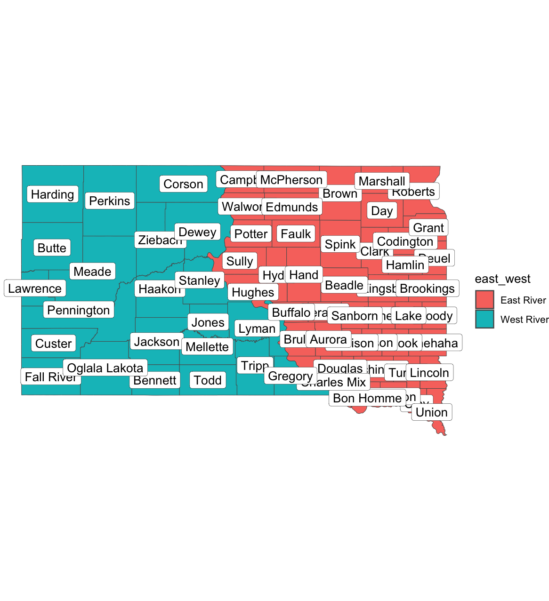

# East/West River Counties in SD
The distinction between "East River" and "West River" is a [longstanding](https://www.travelsouthdakota.com/trip-ideas/article/west-river-vs-east-river) feature of South Dakota culture. This repository contains a convenient list of South Dakota counties and which "side" they belong to. The script used to generate the list is also provided. 

